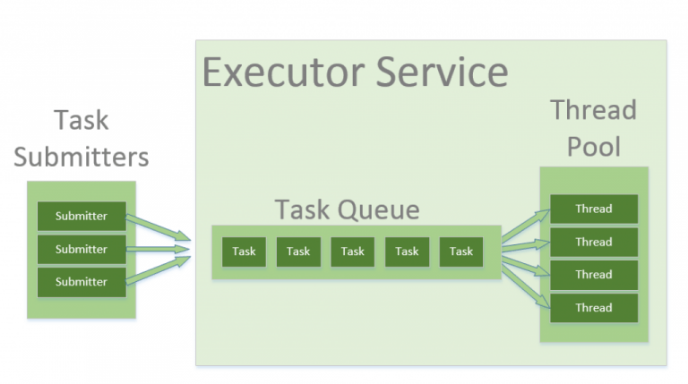

# 线程池与拒绝策略



## 创建线程池

示例：

```java
public class Main {
    public static void main(String[] args) {
        var corePoolSize = 5;
        var maxPoolSize = 10;
        var keepAliveTime = 5;

        var workQueue = new LinkedBlockingQueue<Runnable>(10);

        var executor = new ThreadPoolExecutor(
                corePoolSize,
                maxPoolSize,
                keepAliveTime,
                TimeUnit.SECONDS,
                workQueue
        );

        // 添加 100 个任务
        for (var i = 0; i < 100; i++) {
            try {
                executor.execute(() -> {
                    System.out.println(Thread.currentThread().getName());
                });
            } catch (Exception e) {
                System.out.println(e.getMessage());
            }
        }
    }
}
```

以上代码中的 100 个任务无法全部执行完成，会触发默认拒绝策略。

## 拒绝策略

当提交任务数大于 `corePoolSize` 的时候，优先将任务放到 `workQueue` 队列中。当队列饱和后，会扩充线程池中的线程数，直到达到 `maximumPoolSize`。此时，再多的任务会触发线程池的拒绝策略。

:::note
提交任务数 > (workQueue.size() + maximumPoolSize)，就会触发线程池的拒绝策略。
:::

### 拒绝策略定义

JDK 提供了四种拒绝策略(在 `ThreadPoolExecutor` 中定义)：

- `AbortPolicy`：丢弃任务，并抛出 `RejectedExecutionException`，线程池默认拒绝策略。
- `CallerRunsPolicy`：只要线程池没有关闭，则使用调用线程直接运行任务。
- `DiscardPolicy`：直接丢弃，不抛出异常。
- `DiscardOldestPolicy`：丢弃 `workQueue` 中最老的一个任务，加入新任务。
